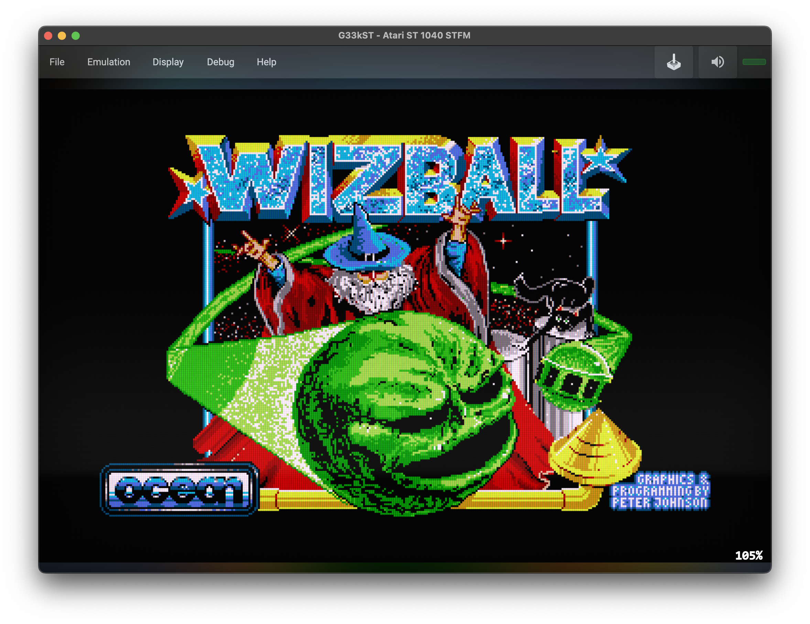
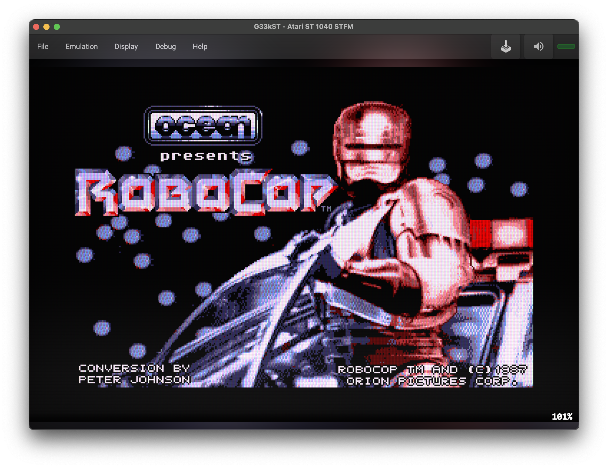
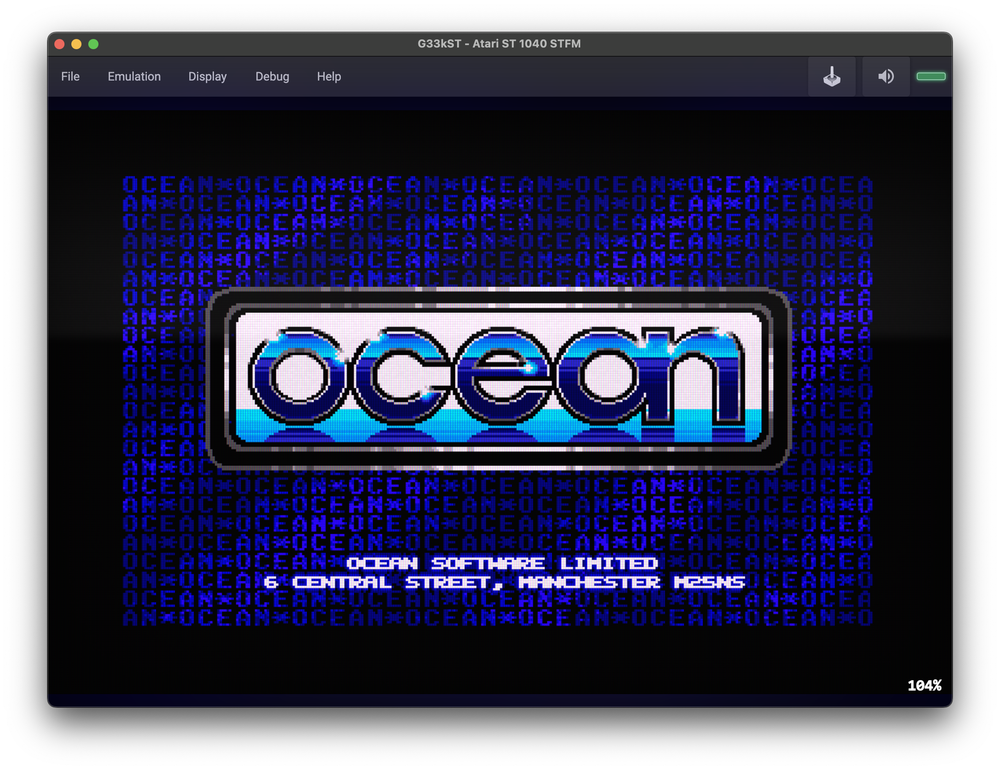
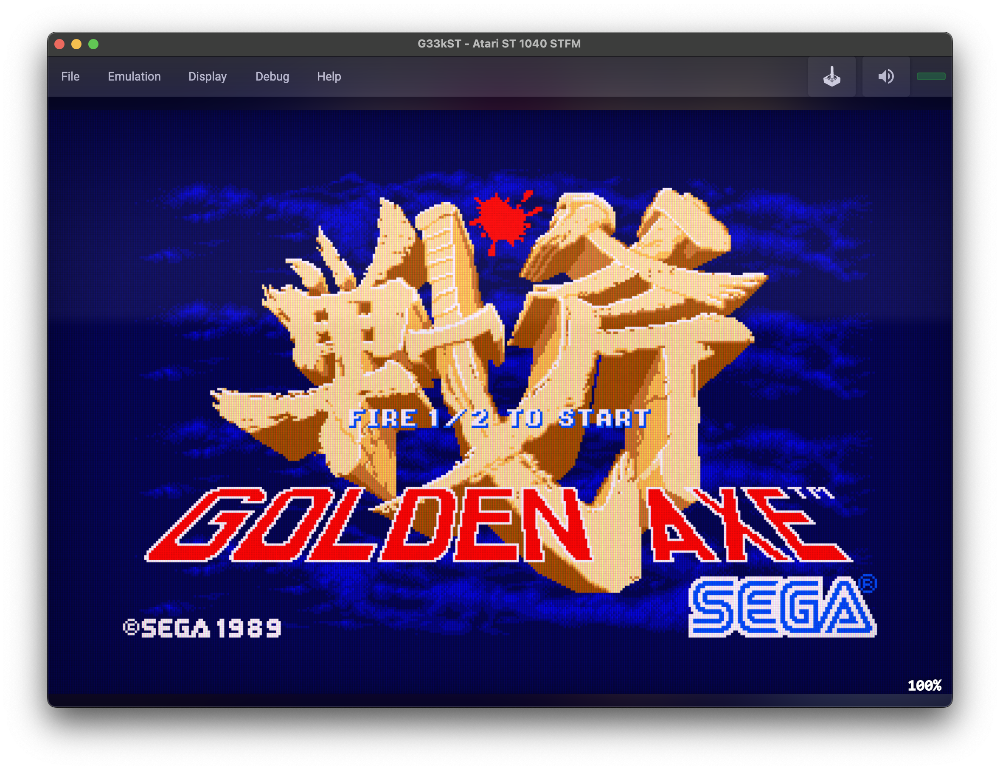

  

# G33kST
A cross-platform Atari ST (520 STFM) emulator written in C#/.NET with an Avalonia UI.

This is a work-in-progress emulator focused on getting real software running reliably, with a pragmatic Motorola 68000 core designed to be reusable in other retro projects.

## Screenshots
<table>
  <tr>
    <td></td>
    <td></td>
    <td></td>
  </tr>
  <tr>
    <td></td>
    <td></td>
    <td></td>
  </tr>
</table>

## Quick start
1. Install the .NET 9 SDK.
2. Run the UI: `dotnet run --project G33kST/G33kST.csproj`
3. Insert a floppy image:
   - Menu: `File -> Floppy -> Insert Disk (A:)...` (Ctrl/Command+O)
   - Drag and drop `.st`, `.stx`, or `.zip` onto the window (quick path)
4. Select a ROM (optional):
   - Menu: `File -> System ROM -> Use Bundled EmuTOS` or `Choose TOS...`

## What you can do
- Boot into EmuTOS and reach the desktop.
- Load floppy images (`.st`, `.stx`, `.zip`) via the UI menu and MRU list.
- Save screenshots and recordings from the `File -> Capture` menu.
- Save/load emulator snapshots (`.stsnap`).

## Status
- Early bring-up, but it's past "hello world": EmuTOS boots and a growing set of titles run.
- Expect rough edges (accuracy gaps, missing peripherals, and the occasional crash).

## Controls (default)
- Mouse: Move/click inside the display area.
- Keyboard: Mapped to ST keys (including function keys).
- Joystick: Toggle host keyboard-to-joystick routing with `Ctrl+J` / `⌘+J` (off by default, not persisted).
  - With joystick input enabled: arrow keys = directions, `Z` = fire, `A` = auto-fire.

## Keyboard shortcuts
- Reset: `Ctrl+R` / `⌘+R`
- Hard reset: `Ctrl+Shift+R` / `⌘+Shift+R`
- Insert disk (A:): `Ctrl+O` / `⌘+O`
- Choose TOS: `Ctrl+Shift+O` / `⌘+Shift+O`
- Screenshot: `Ctrl+S` / `⌘+S`
- Toggle recording: `Ctrl+M` / `⌘+M`
- Toggle joystick input: `Ctrl+J` / `⌘+J`
- Quit: `Ctrl+Q` / `⌘+Q`

## Highlights
- **Boots EmuTOS**: enough bring-up to reach the desktop and run a growing set of titles.
- **Disk images**: load `.st`, `.stx`, and `.zip` via the UI (plus drag and drop for `.st`/`.zip`).
- **Capture tools**: screenshots, recording, and snapshots for quick testing/sharing.
- **Cross-platform UI**: Avalonia desktop shell with menus, MRU lists, and shortcuts.

## Background
After building a [ZX Spectrum emulator](https://github.com/deanthecoder/ZXSpeculator), a [Game Boy emulator](https://github.com/deanthecoder/G33kBoy), and a [Sega Master System emulator](https://github.com/deanthecoder/MasterG33k), I wanted to tackle the Atari ST.
G33kST is my way of learning its hardware properly, starting from a pragmatic and reusable Motorola 68000 core.

## Test data
The single-step 68000 test data comes from the excellent `m68000` repo by SingleStepTests, used under its license:
https://github.com/SingleStepTests/m68000

The MC68000 opcode test suite by **Ted Fried / MicroCore Labs** is included under:
`external/MC68000_Test_Code`
Source: https://github.com/MicroCoreLabs/Projects/tree/master/MCL68/MC68000_Test_Code

## EmuTOS ROM usage
For integration/boot tests this repository currently uses an EmuTOS ROM image:
- `DTC.AtariST/TOS/etos192us.img`

References:
- EmuTOS project: https://github.com/emutos/emutos
- EmuTOS manual (license section): https://emutos.github.io/manual/#license

Licensing note:
- EmuTOS is GPL-licensed (GNU GPL v2, per EmuTOS documentation).
- G33kST source code remains MIT-licensed.
- The bundled EmuTOS ROM is third-party software under its own license terms and attribution requirements.
- If/when redistributing binaries or source bundles, keep EmuTOS attribution and GPL materials alongside that ROM artifact.

## Useful links
- [Motorola 68000 Programmer's Reference Manual](https://www.nxp.com/docs/en/reference-manual/M68000PRM.pdf)
- [Atari ST Wiki (Hardware Overview)](https://en.wikipedia.org/wiki/Atari_ST)
- [M68k opcode maps (PDF)](http://goldencrystal.free.fr/M68kOpcodes-v2.3.pdf)

## License
Licensed under the MIT License. See [LICENSE](LICENSE) for details.
